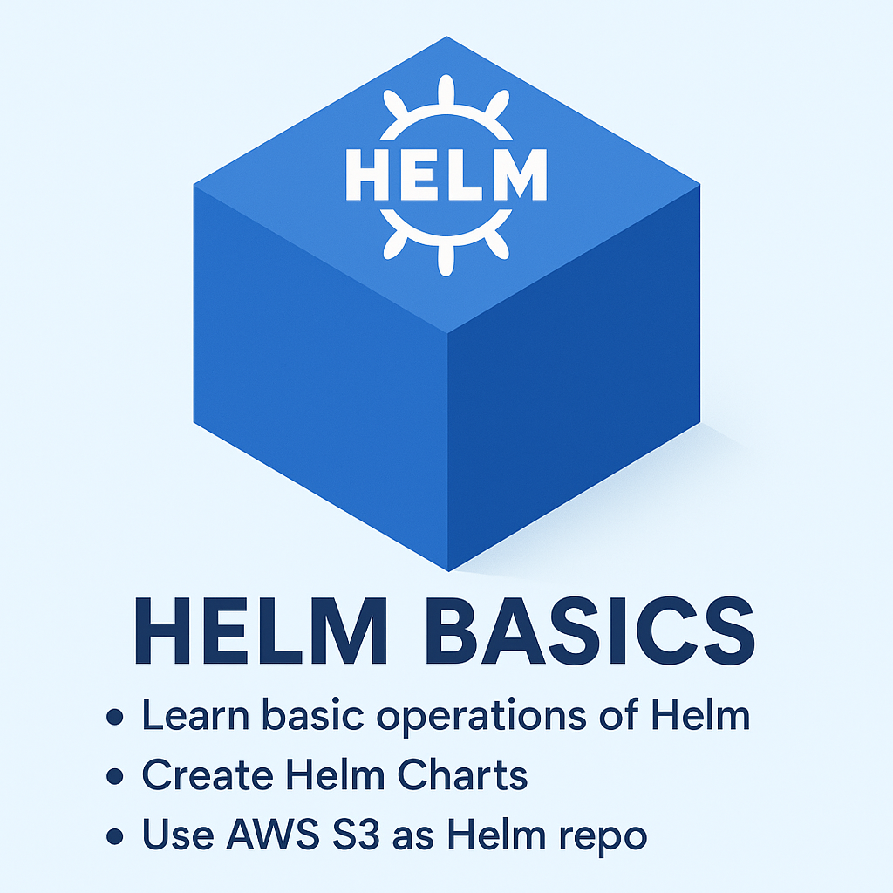

# 🧠 Hands-on Kubernetes-08: Helm Basics (mokutanway)

 

> 📦 This project provides a hands-on learning experience to master **Helm** – the package manager for Kubernetes.

---

## 🎯 Learning Outcomes

By the end of this hands-on training, you will be able to:

- Understand basic operations of Helm.
- Create custom Helm Charts.
- Host Helm Charts on GitHub or AWS S3.
- Manage chart releases and upgrades securely.

---

## 🗂️ Outline

1. ✅ Setting up the Kubernetes Cluster
2. 📦 Basic Operations with Helm
3. 🛠️ Creating a Helm Chart (mokutanway)
4. 🌍 Hosting a Helm Repository
5. 🔄 GitHub Repo Integration

---

## 🚀 Part 1: Setting up Kubernetes Cluster

> Use either CloudFormation or [KillerCoda](https://killercoda.com/playgrounds)

```bash
kubectl cluster-info
kubectl get nodes
```

## 📦 Part 2: Basic Helm Operations

### Install Helm

```bash 
curl https://raw.githubusercontent.com/helm/helm/main/scripts/get-helm-3 | bash
helm version
```

### Initialize Helm and add stable repo

```bash
helm repo add stable https://charts.helm.sh/stable 
helm repo update
```

### Verify Helm installation

```bash
helm version  
helm repo list
helm search repo stable
helm install my-release stable/nginx-ingress    
helm list
```

### Add Bitnami repo & install chart

```bash 
helm repo add bitnami https://charts.bitnami.com/bitnami
helm repo update
helm search repo bitnami
helm install mysql-release bitnami/mysql
helm list
helm show values bitnami/mysql > myvalues.yaml
helm install my-mysql bitnami/mysql -f myvalues.yaml
helm uninstall my-mysql
```

---

## 🛠️ Part 3: Creating a Helm Chart – mokutanway

### Create chart

```bash             
helm create mokutanway-chart
rm -rf mokutanway-chart/templates/*
touch mokutanway-chart/templates/configmap.yaml
```

### Add the following to configmap.yaml

```yaml 
apiVersion: v1
kind: ConfigMap
metadata:
  name: mokutanway-config
data:
  myvalue: "Hello Helm World"
```

### Install chart

```bash
helm install demo mokutanway-chart
kubectl get configmap
kubectl describe configmap mokutanway-config
```

### Update configmap.yaml

```yaml
apiVersion: v1
kind: ConfigMap
metadata:
  name: mokutanway-config
data:
  myvalue: "Hello Updated Helm World"
```

### Upgrade release

```bash 
helm upgrade demo mokutanway-chart
kubectl describe configmap mokutanway-config
```

### Dynamic values: values.yaml

```yaml
course: DevOps
lesson:
  topic: helm
```

### Use in configmap.yaml

```yaml
data:
  course: {{ quote .Values.course }}
  topic: {{ upper .Values.lesson.topic }}
  time: {{ now | date "2006.01.02" | quote }}
```

---

## 📜 Adding NOTES.txt

```txt
Thank you for installing {{ .Chart.Name }}!

Your release is named {{ .Release.Name }}

Useful Commands:
  $ helm status {{ .Release.Name }}
  $ helm get all {{ .Release.Name }}
```

```bash
helm install notes-demo mokutanway-chart
```

---

## 🌍 Part 4: Hosting a Helm Repository on GitHub

```bash
mkdir helm-mokutanway && cd helm-mokutanway
helm package ../mokutanway-chart
helm repo index .
```

### Push to GitHub

```bash
git init
git add .
git commit -m "Initial commit"
git remote add origin https://github.com/angvan53/helm-mokutaway.git
git push -u origin main
```

### Add repo locally

```bash
helm repo add my-mokutan-repo https://raw.githubusercontent.com/angvan53/helm-mokutaway/main
helm repo update
helm search repo my-mokutan-repo
```

---

## 📞 Example Chart Deployment

```bash
helm upgrade --install phonebook-app my-mokutan-repo/phonebook-chart   --set webserver_image=nginx   --set resultserver_image=httpd
```

---

## 🧹 Cleanup

```bash
helm uninstall notes-demo
helm uninstall phonebook-app
helm repo remove bitnami my-mokutan-repo
helm repo index .
```

---

## 🔒 Private Deployment Note

This repository is kept private for security. Ensure secrets are not committed and consider using .gitignore for sensitive Helm values or token files.

---

## 📂 Project Structure

helm-mokutaway/
│
├── mokutanway-chart/
│   ├── templates/
│   │   ├── configmap.yaml
│   │   └── NOTES.txt
│   └── values.yaml
│
├── images/
│   └── helm-intro.png
└── README.md

---

## 👤 Author

GitHub: angvan53  
Project: helm-mokutanway
=======
# helm-mokutaway
Okutan 
